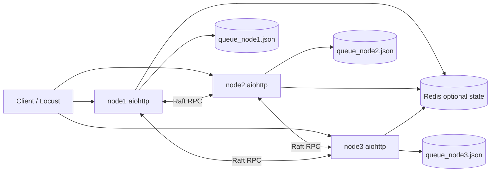

# Arsitektur Sistem



## Node

Setiap node menjalankan satu proses `aiohttp` yang memuat:

- `RaftNode` untuk leader election, heartbeat, log replication, dan commit command lock.
- `DistributedLockManager` untuk shared/exclusive lock dan deadlock detection.
- `DistributedQueue` untuk topic ownership memakai consistent hashing.
- `MESICache` untuk coherence state `M/E/S/I`, invalidation, dan update propagation.
- `FailureDetector` untuk heartbeat health check antar-node.
- `MetricsRegistry` untuk counter, gauge, dan latency snapshot.

## Raft untuk Lock Manager

Lock operation dibuat sebagai command log:

```json
{"action":"acquire","resource":"inventory","owner":"client-a","mode":"exclusive"}
```

Leader menerima command, mereplikasi ke follower melalui `/raft/append_entries`, lalu meng-commit setelah mayoritas menerima entry. Follower menerapkan command yang sudah committed ke state machine lock lokal. Jika terjadi network partition, sisi yang tidak memiliki mayoritas tidak dapat commit sehingga state lock tidak bercabang.

## Lock Semantics

- Shared lock bisa dimiliki banyak owner selama tidak ada exclusive owner.
- Exclusive lock hanya bisa diberikan jika tidak ada owner lain.
- Request yang belum bisa diberikan dimasukkan ke wait queue.
- Deadlock detection membangun wait-for graph dan mencari cycle antar owner.

## Distributed Queue

Topic dipetakan ke node owner menggunakan consistent hashing. Producer boleh mengirim ke node mana pun; node non-owner akan meneruskan request ke owner. Message disimpan ke file JSON per node agar bisa recovery setelah restart.

At-least-once delivery dicapai dengan inflight map dan visibility timeout. Jika consumer mengambil message tetapi tidak melakukan ack, message akan dikembalikan ke queue setelah timeout dan dapat dikirim ulang.

## Cache Coherence MESI

Write lokal membuat entry menjadi `Modified`. Node penulis mengirim invalidation dan update ke peer. Peer menyimpan update sebagai `Shared`. Entry bisa menjadi `Invalid` jika menerima invalidation dengan versi yang sesuai. Replacement policy default adalah LRU, dan LFU tersedia lewat konstruktor.

## Failure Scenario

- Node down: failure detector menandai peer failed setelah timeout.
- Queue owner restart: message dipulihkan dari persistence file.
- Consumer crash: message inflight kembali visible setelah visibility timeout.
- Network partition: Raft hanya commit pada partition yang punya mayoritas.
